<h1 align="center">Hi 👋, I'm Vishakha Rawat</h1>
<h3 align="center">MERN Stack Developer | AI/ML Enthusiast 🚀</h3>

---

## 💫 About Me
- 🚀 MERN Full-Stack Developer  
- 🤖 Passionate about AI & Machine Learning  
- 💡 Love building real-world scalable applications  
- 🌱 Currently working on AI SaaS & Full Stack Projects  
- 🎯 Goal: Become a Full Stack + AI Engineer  

---

## 👨‍💻 Projects
- 🍔 **Food Delivery Website**  
- 📊 **Sales Prediction System**  
- 🎥 **Real-time Video Sharing App**  

👉 Explore all my projects:  
🔗 https://github.com/vishakha952  

---

## ⚒️ Tech Stack
Frontend: React.js | HTML | CSS | Tailwind  
Backend: Node.js | Express.js  
Database: MongoDB | MySQL  
Languages: C++ | Java | Python | JavaScript  

---

## 📊 GitHub Stats

  
  

---

## 🌐 Connect
- Twitter: https://twitter.com/Vishakharawat95  
- LinkedIn: https://www.linkedin.com/in/vishakharawat/  

📫 Email: your-email-here@gmail.com  

---

## ✨ Quote
_"Code. Build. Learn. Repeat."_ 🚀
